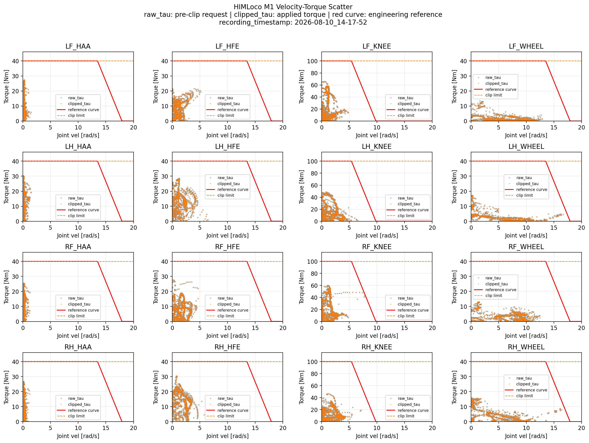
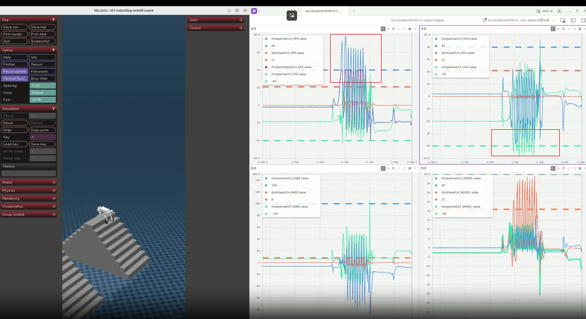
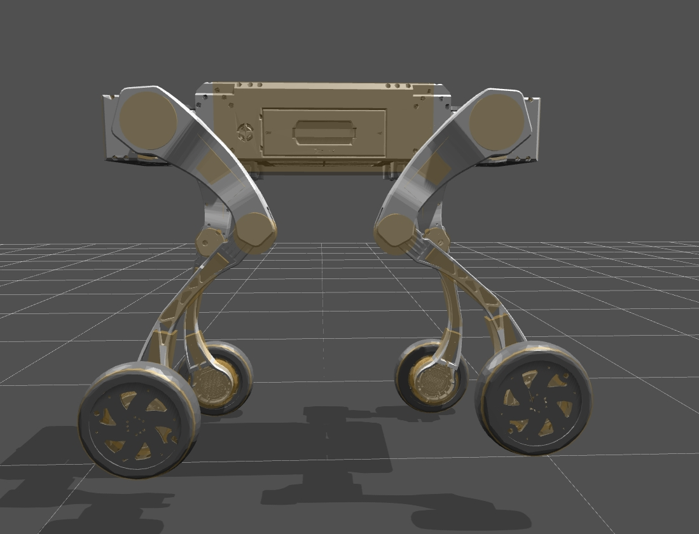
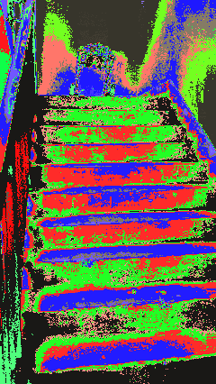
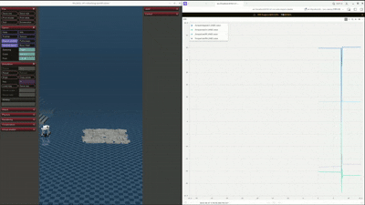
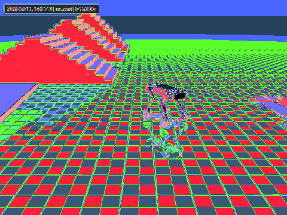
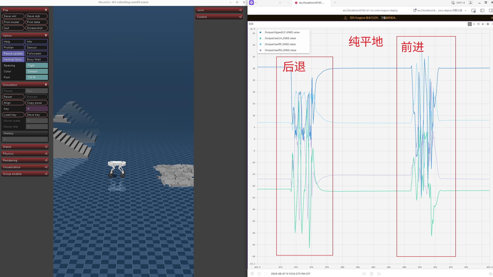
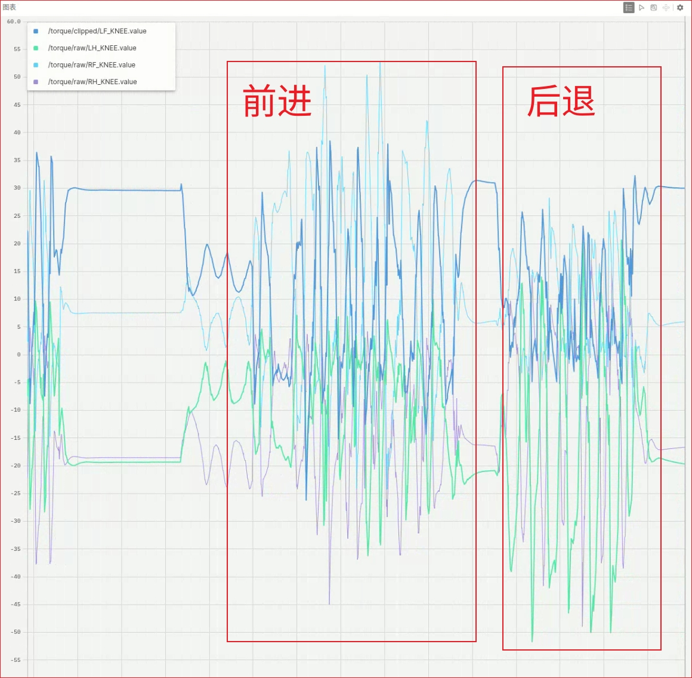

# M1-HIMLoco

## Package Layout

```text
legged_gym/
  Training environments, task configs, training scripts, and policy export tools.

rsl_rl/
  PPO and HIM policy implementation used by training.

mujoco/
  MuJoCo sim-to-sim deploy scripts, evaluation tools, and deploy configs.

resources/
  Robot assets, including URDF, MJCF, and meshes.

logs/
  Training runs, checkpoints, and exported policy files.

images/
  Figures, screenshots, recorded deploy outputs, and documentation assets.
```

## Task Variants

This repository currently focuses on two M1 tasks:

- `m1_him`
  Standard HIM task. Commands are kept in the temporal history and are visible to the estimator.
- `m1_him_no_cmd`
  Deploy-oriented HIM variant. Commands are stripped from the estimator history input, while the actor still receives the current one-step observation with commands.

In `m1_him_no_cmd`, the command signal is not removed from the full policy pipeline. The estimator internally removes the command slice from stacked history before encoding it, and the actor still consumes the full current observation together with the estimated velocity and latent feature.

## Quick Start

This codebase assumes that Isaac Gym is already installed in the environment.

```bash
cd HIMLoco-for-Go2W
pip install -e ./rsl_rl
pip install -e .
```

Train `m1_him`:

```bash
cd legged_gym/scripts
python train.py --task=m1_him
```

Train `m1_him_no_cmd`:

```bash
cd legged_gym/scripts
python train.py --task=m1_him_no_cmd
```

Replay the latest trained policy:

```bash
cd legged_gym/scripts
python play.py --task=m1_him
python play.py --task=m1_him_no_cmd
```

## Sim-to-Sim


Run the standard HIM deploy path:

```bash
cd mujoco
python deploy_mujoco_m1.py
```
<!-- 
Default config and assets:

- config: `mujoco/configs/m1.yaml`
- ONNX policy: `logs/M1_HIM/exported/policies/policy.onnx`
- MuJoCo scene: `resources/robots/m1/scene.xml` -->

Run the no-command deploy path:

```bash
cd mujoco
python deploy_mujoco_m1_no_cmd.py
```

Default config and assets:

- config: `mujoco/configs/m1_no_cmd.yaml`
- ONNX policy: `logs/M1_HIM_NoCmd/exported/policies/policy.onnx`
- MuJoCo scene: `resources/robots/m1/scene.xml`

Both deploy scripts support:

- `--config <yaml>` to override the deploy config
- `--onnx <path>` to override the ONNX file

The no-command deploy script also supports fixed commands:

```bash
cd mujoco
python deploy_mujoco_m1_no_cmd.py --cmd-x 0.8 --cmd-y 0.0 --cmd-yaw 0.0
```

Keyboard fallback for `deploy_mujoco_m1_no_cmd.py`:

- `W/S`: forward / backward
- `Q/E`: strafe left / right
- `A/D`: yaw left / right
- `Space`: clear command
- `R`: reset robot

## Deploy Recording

`deploy_mujoco_m1_no_cmd.py` includes a built-in recording mode for debug and behavior review.

Hotkeys:

- `O`: start recording
- `P`: stop recording and save outputs

Outputs are written under:

- `mujoco/debug_recordings/<timestamp>_no_cmd_torque_debug/`

When a recording is completed successfully, the script saves:

- `<timestamp>_mujoco_recording.gif`
- `<timestamp>_torque_scatter.png`

The GIF contains a timestamp overlay and simulation time overlay. The torque scatter plot is generated from recorded policy-order joint velocities, raw torques, and clipped torques.

To enable the live raw torque monitor window:

```bash
cd mujoco
python deploy_mujoco_m1_no_cmd.py --enable-monitor
```

Useful monitor options:

- `--history-seconds <sec>`
- `--plot-refresh-interval <sec>`

Example outputs from the deploy recording flow:

Recorded MuJoCo behavior example 1:


Recorded torque scatter output:



## Foxglove Logging

For MuJoCo deploy with Foxglove streaming and MCAP recording:

```bash
cd mujoco
python deploy_mujoco_m1_no_cmd_foxglove.py
```

Default behavior:

- config: `mujoco/configs/m1_no_cmd.yaml`
- WebSocket server: `ws://127.0.0.1:8765`
- MCAP output: `m1_no_cmd_deploy_recording.mcap`
- published joints: all joints in `train_dof_names`

Published channels:

- `/cmd`
- `/base_lin_vel`
- `/base_ang_vel`
- `/torque/raw/<joint_name>`
- `/torque/clipped/<joint_name>`
- `/action/policy/<joint_name>`
- `/joint/qvel/<joint_name>`

Useful options:

- `--foxglove-host <host>`
- `--foxglove-port <port>`
- `--mcap <path>`
- `--foxglove-joints LF_HAA,LF_HFE,...`
- `--foxglove-exclude-joints LF_WHEEL,RF_WHEEL,...`
- `--onnx <path>`
- `--cmd-x <vx>`
- `--cmd-y <vy>`
- `--cmd-yaw <wz>`

Example:

```bash
cd mujoco
python deploy_mujoco_m1_no_cmd_foxglove.py \
  --foxglove-host 0.0.0.0 \
  --foxglove-port 8765 \
  --mcap ./outputs/m1_no_cmd_run.mcap
```

Flat-ground torque view captured in Foxglove:



## Export ONNX

<!-- Export `m1_him`:

```bash
cd legged_gym/scripts
python export_onnx.py --task m1_him
``` -->

Export `m1_him_no_cmd`:

```bash
cd legged_gym/scripts
python export_onnx.py --task m1_him_no_cmd
```

Default export behavior:

- load checkpoint from `logs/<experiment>/<latest_run>/<latest_checkpoint>`
- write ONNX to `logs/<experiment>/exported/policies/policy.onnx`

Default experiment names:

- `m1_him` -> `M1_HIM`
- `m1_him_no_cmd` -> `M1_HIM_NoCmd`

Useful options:

- `--load_run <run_dir>`
- `--checkpoint <N>`
- `--output_dir <dir>`
- `--output_name <name>`
- `--rl_device cpu|cuda:0`

<!-- Example:

```bash
cd legged_gym/scripts
python export_onnx.py \
  --task m1_him_no_cmd \
  --load_run Aug01_12-00-00_ \
  --checkpoint 5000 \
  --output_dir ../../artifacts/onnx \
  --output_name m1_no_cmd_5000.onnx
``` -->

The exported ONNX interfaces are different:

- `m1_him`: one input, `obs_history`
- `m1_him_no_cmd`: two inputs, `obs_history_no_cmd` and `obs_curr`

This matches the MuJoCo deploy path, where the no-command estimator history is stripped on the deploy side while the actor still uses the full current observation.

## Performance

Current M1 robot model used in this project.



Current real-robot stair traversal behavior:



<!-- Foxglove live view example:

 -->

- Flat-ground deploy behavior:



Torques distribution:





The real-robot behavior is still not fully satisfactory on rough terrain. The policy tends to produce different torque magnitudes between the front legs and the rear legs. This asymmetry makes the robot more likely to drag its legs when moving over rough terrain, so the current policy and reward design still need further adjustment.

## Recommended Training Schedule

For M1 training, a two-stage schedule is currently recommended in [legged_gym/envs/m1/m1_config.py](/home/ltr/Desktop/LTR-M1-Dreamwq-m1-dreamwaq/HIMLoco-for-Go2W/legged_gym/envs/m1/m1_config.py).

Stage 1, early stabilization:

- set `terrain.mesh_type = "plane"`
- set `rewards.enable_dreamwaq_joint_penalties = False`

This stage is used to obtain an initial stable checkpoint more easily. The goal is not to get the final terrain-capable policy, but to reduce early optimization difficulty and let the policy first learn basic locomotion.

Stage 2, resume on terrain:

- resume training from the checkpoint obtained in Stage 1
- switch `terrain.mesh_type` from `plane` to terrain training, for example the current `trimesh` setup
- set `rewards.enable_dreamwaq_joint_penalties = True`

This second stage is the more deployment-oriented stage. In the current setup, the joint penalties are relatively strict. They are likely over-constrained and still need further tuning, but they help produce more stable stair-climbing behavior.

At the moment, the practical recommendation is:

1. Train on `plane` with joint penalties disabled.
2. Save a usable checkpoint.
3. Resume training on terrain with joint penalties enabled.

The joint penalty design is still under active adjustment. The current version is useful for stability, especially on stairs, but it should not be treated as the final reward setting.

## Reference

This repository is adapted from [TrackinBIT/HIMLoco-for-Go2W](https://github.com/TrackinBIT/HIMLoco-for-Go2W), which provides the original Go2W implementation built on the HIMLoco framework. `M1-HIMLoco` reuses the overall training and deployment structure, and retargets it to M1-specific models, assets, configurations, and MuJoCo tooling.
